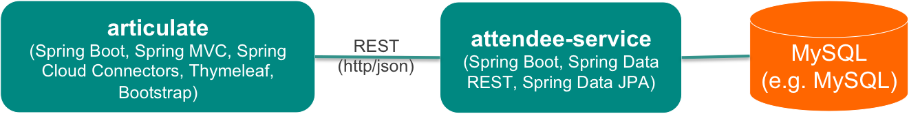
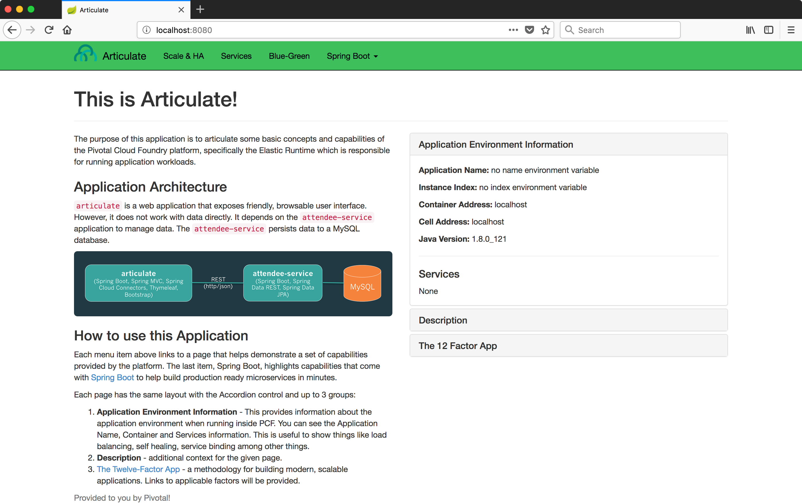

# PCF 101 Series: Articulate + Attendee



Both `Articulate` and `Attendee` applications are sample applications built with [Spring Boot](http://projects.spring.io/spring-boot/).

The main purposes here are to demonstrate some of Pivotal Cloud Foundry's interesting capacity.
Some scenarios like below will be covered:

1. Lightning fast of application deployment by `cf push`

2. Service mindset by `cf create-service`


Meanwhile, I also create the CI / CD pipelines for `articulate` application 
by using [Concourse](http://concourse.io).


## To run the applications locally

```
$ git clone https://github.com/brightzheng100/pcf101-articulate-attendee.git
$ cd pcf101-articulate-attendee

$ ./mvnw spring-boot:run -f articulate/pom.xml
$ ./mvnw spring-boot:run -f attendee/pom.xml
```

Now, the `articulate` webapp is already serving on port `8080`
and the backend app `attendee`, providing RESTful services for `articulate`,
will be serving on port `8181`, which is exactly the default setting in `articulate`.


Go to the http://localhost:8080 in your browser and you should see below screen:



## To Run on Cloud Foundry

Assuming you have logged into your Cloud Foundry targeting the proper organization and space.

```
$ ./mvnw package

$ cf push -f attendee/manifest.yml
$ cf push -f articulate/manifest.yml
```

Now they're working independently.
Copy the route generated for `attendee` app and it's time to let `articulate` app talks to `attendee` service:

```
$ cf cups attendee-service -p uri
    uri> <KEY IN URL OF ATTENDEE APP AND ENTER, e.g. https://attendee.apps.mycompany.com/>
$ cf bind-service articulate attendee-service
$ cf restage articulate
```

> Tips: 
> 1. It's recommended to try out [Pivotal Web Services](https://run.pivotal.io)
> 2. Please refer to `articulate/manifest-with-service.yml` for how to add service binding directly
> within the yaml file so that the service binding process can be fully automated.


By default, the `attendee` app uses an embedded H2 database to persistent attendee records.
If you want to use MySQL, it's just some commands away:

```
$ cf create-service <MYSQL SERVICE> <MYSQL PLAN> <MYSQL_SERVICE_INSTANCE_NAME>
$ cf bind-service attendee <MYSQL_SERVICE_INSTANCE_NAME>
$ cf restage attendee
```

## CI/CI By Concourse

There is CI/CD pipeline for [Concourse](http://concourse.ci) built in.
To try it out:

```
$ 
```


## Clean Up

To clean up the env, simply issue below commands:

```
$ cf delete articulate -r
$ cf delete attendee -r
$ cf delete-service attendee-service
```

# Credits

This project is originated from https://github.com/pivotal-education/pcf-articulate-code